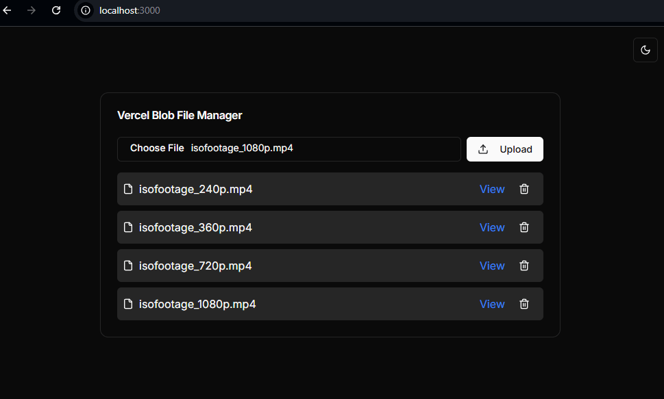

# Vercel Blob File Manager

A simple, open-source tool to manage your Vercel Blob storage files directly from your browser. This project provides an intuitive interface for uploading, listing, viewing, and deleting files in your Vercel Blob storage.



## Features

- Upload files to Vercel Blob storage
- List all uploaded files with details (name, type, size, upload date)
- View file details and download links
- Delete files from storage
- Dark mode support with system preference detection
- Responsive design for desktop and mobile use

## Tech Stack

- [Next.js](https://nextjs.org/) - React framework for building the UI
- [Vercel Blob](https://vercel.com/docs/concepts/storage/blob) - For file storage
- [Tailwind CSS](https://tailwindcss.com/) - For styling
- [next-themes](https://github.com/pacocoursey/next-themes) - For dark mode support
- [Lucide React](https://lucide.dev/) - For icons

## Getting Started

### Prerequisites

- Node.js 14.x or later
- A Vercel account with Blob storage enabled
- Vercel Blob Read/Write token

### Installation

1. Clone the repository:
   ```
   git clone https://github.com/lpolish/vercel-blob-file-manager.git
   cd vercel-blob-file-manager
   ```

2. Install dependencies:
   ```
   npm install
   ```

3. Create a `.env.local` file in the root directory and add your Vercel Blob token:
   ```
   BLOB_READ_WRITE_TOKEN=your_token_here
   ```

4. Run the development server:
   ```
   npm run dev
   ```

5. Open [http://localhost:3000](http://localhost:3000) with your browser to see the result.

## Usage

- To upload a file, click the "Choose File" button, select a file, and click "Upload".
- The list of files will automatically update after each upload or deletion.
- To view or download a file, click the "View" link next to the file name.
- To delete a file, click the trash icon next to the file name.
- Use the theme toggle in the top-right corner to switch between light, dark, and system color schemes.

## Contributing

Contributions are welcome! Please feel free to submit a Pull Request.

1. Fork the project
2. Create your feature branch (`git checkout -b feature/AmazingFeature`)
3. Commit your changes (`git commit -m 'Add some AmazingFeature'`)
4. Push to the branch (`git push origin feature/AmazingFeature`)
5. Open a Pull Request

Please ensure your pull request adheres to the following guidelines:
- Follow the [Conventional Commits](https://www.conventionalcommits.org/) specification for commit messages
- Update the README.md with details of changes to the interface, if applicable
- Increase the version numbers in any examples files and the README.md to the new version that this Pull Request would represent

## License

This project is licensed under the MIT License - see the [LICENSE](LICENSE) file for details.

## Acknowledgments

- [Vercel](https://vercel.com) for providing the Blob storage service
- [Next.js](https://nextjs.org) for the React framework
- [Tailwind CSS](https://tailwindcss.com) for the utility-first CSS framework
- [Lucide](https://lucide.dev) for the beautiful icons
- [next-themes](https://github.com/pacocoursey/next-themes) for the theming solution

## Support

If you have any questions or run into any issues, please open an issue in this repository.

## Roadmap

- [ ] Add file preview feature for images and PDFs
- [ ] Implement file renaming functionality
- [ ] Add folder support for better organization
- [ ] Implement drag-and-drop file upload
- [ ] Add search functionality for files
- [ ] Implement file sharing with expiring links

## Changelog

See [CHANGELOG.md](CHANGELOG.md) for details on each release.

## Security

For any security issues, please email hello@luispulido.com instead of using the issue tracker.